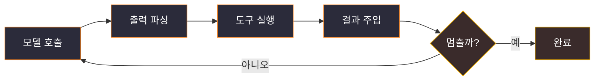
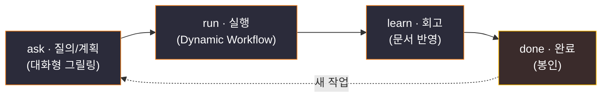

# Claude Code 기초 + forge 입문

> AI 코딩을 "프롬프트를 잘 치는 일"에서 "AI를 굴리는 시스템을 설계하는 일"로 한 단계 끌어올리는 입문 학습 자료입니다. Claude Code의 기본 기능부터, 그 바탕이 되는 사고방식(하네스·루프·컴파운드)과 메커니즘(그릴링·에이전트·Dynamic Workflow)을 쌓아 올린 뒤, 그 전부를 하나로 묶은 한국어 워크플로우 **forge**로 착지합니다.
>
> 📥 발표용 슬라이드: [`forge-입문-발표.pptx`](./forge-입문-발표.pptx) (44장, 한국어 발표자 노트 포함). 이 문서는 그 덱을 **발표자 없이 읽어도 이해되도록** 풀어 쓴 자습용 버전입니다.

**TL;DR** — AI 코딩의 성능은 모델이 아니라 *모델을 둘러싼 시스템(하네스)* 이 좌우한다. 그래서 우리는 프롬프트를 치는 사람에서 *루프를 설계하는 사람* 으로 올라서고, 학습을 문서로 환원해 *복리* 로 쌓는다. **forge**는 이 사고방식을 `질의·계획 → 실행 → 회고 → 완료`라는 한 바퀴 루프로 제도화한 도구다.

---

## 목차

- [왜 이걸 알아야 하나](#왜-이걸-알아야-하나)
- [Part 1 — Claude Code 기초](#part-1--claude-code-기초)
- [Part 2 — 사고방식: 왜 이렇게 일하는가](#part-2--사고방식-왜-이렇게-일하는가)
- [Part 3 — 메커니즘: 어떻게 굴리는가](#part-3--메커니즘-어떻게-굴리는가)
- [Part 4 — forge: 전부를 한 루프로](#part-4--forge-전부를-한-루프로)
- [기억할 세 문장](#기억할-세-문장)

---

## 왜 이걸 알아야 하나

많은 사람이 "AI 코딩 = 프롬프트를 잘 쓰는 것"이라고 생각합니다. 하지만 실제 생산성은 프롬프트 한 줄이 아니라 그 **주변 시스템** — 컨텍스트 관리, 도구, 검증, 반복 루프 — 에서 갈립니다. 프롬프트 한 줄을 다듬는 것만으로 생산성이 갈리던 시대는 지나가고 있습니다.

이 문서의 한 줄 메시지는 이것입니다:

> **AI에게 더 잘 "부탁"하는 법이 아니라, AI를 "굴리는 시스템"을 짜는 법.**

아래 4개 파트는 도구(1) → 왜(2) → 어떻게(3) → 종합(4) 순서로 쌓입니다. Part 3의 세 메커니즘(그릴링·에이전트·워크플로우)은 Part 4에서 forge의 스킬로 그대로 착지하니, 읽다 보면 "아, 이게 그거구나" 하고 연결됩니다. 도착점은 forge입니다.

---

## Part 1 — Claude Code 기초

> 먼저 "도구가 무엇을 할 수 있는가"를 입문자 눈높이로 정리합니다. 깊이 들어가기보다, 뒤에서 다룰 사고방식·메커니즘의 토대가 되는 기능들을 지도처럼 봅니다.

### Claude Code란?

터미널에서 `claude` 명령으로 실행하는 **대화형 AI 코딩 에이전트**입니다. 코드베이스 전체에 접근해 파일을 읽고·고치고·명령을 실행합니다.

핵심 인식 전환은 이것입니다 — Claude Code는 *IDE 속 자동완성*이 아니라 **"터미널에 상주하는 시니어 동료"** 입니다. 자동완성은 내가 타이핑하는 걸 거들지만, Claude Code는 내가 일을 **위임하고 결과를 검토하는** 관계입니다. 이 관계 전환이 뒤에 나올 하네스·루프 사고방식의 출발점입니다.

- 한 줄로: **내가 타이핑하는 게 아니라 — 위임하고 검토한다.**
- 실행 채널은 여러 개(CLI · 데스크톱(Mac/Win) · 웹 · IDE 확장(VS Code·JetBrains))지만 모두 같은 엔진입니다.

### 핵심 기능 지도 — "사무실" 비유

6개 기능을 회사 조직에 빗대면 한눈에 들어옵니다. 용어에 질리기 전에 이 비유 한 세트만 기억해도 충분합니다.

| 기능 | 사무실 비유 | 한 줄 정의 |
|------|------------|-----------|
| **Skills** | 업무 매뉴얼 | 반복 절차를 `SKILL.md`로 패키징 — 필요할 때만 로드(lazy-load) |
| **CLAUDE.md** | 사내 규정집 | 팀 표준·개인 선호를 세션마다 기억(Memory) |
| **Hooks** | 자동 결재 규칙 | 생명주기 이벤트마다 셸 명령 실행(포맷·린트·알림) |
| **Permissions** | 출입 권한 | 도구 사용을 Allow / Ask / Deny로 통제 |
| **MCP** | 외부 거래처 직통 회선 | GitHub·Jira·DB 등 외부 도구 표준 연결 |
| **Subagents** | 전담 인턴 | 무거운 탐색·검증을 격리해 위임 |

### 대화 · 명령 · 계획 — 매일 쓰는 세 조작

- **대화형 CLI** — `claude`로 코드베이스 맥락 위에서 자연어로 작업.
- **Slash commands** — `/init` `/model` `/context` `/agents` `/mcp` 등으로 세션을 빠르게 제어.
- **Plan mode** — 읽기만 하고 계획만 세우는 모드(소스 미수정). 큰 변경 전 "먼저 보고 받고, 승인 후 실행"하는 안전장치입니다. 뒤에 나올 "그릴링/계획 우선" 사고와도 이어집니다.

### 기억하는 방법 — Skills & CLAUDE.md

사람은 잊지만, 잘 쓰면 시스템은 기억합니다. 이것이 "시스템이 기억하게 만드는" 두 축입니다.

- **Skills** — 반복 작업을 절차로 패키징. 필요할 때만 lazy-load돼 컨텍스트를 절약합니다.
- **CLAUDE.md (Memory)** — 계층형 영구 지시(managed → user → project → local). 팀 표준·개인 선호를 보존합니다.

이 "기억" 능력이 뒤에 나올 **컴파운드 엔지니어링**("에이전트는 잊어도, 저장소는 기억한다")의 토대가 됩니다.

### 자동화와 통제 — Hooks & Permissions

에이전트를 믿되, 검증 가능하게 만드는 두 장치입니다.

- **Hooks** — 생명주기 이벤트(`PreToolUse`·`PostToolUse`·`SessionStart` 등)에 셸 명령을 실행합니다. Claude가 판단하는 게 아니라 **시스템(셸)이 결정론적으로** 실행하므로, "항상" 포맷되고 "항상" 검증됩니다.
- **Permissions** — Allow / Ask / Deny 규칙 + 권한 모드(plan · acceptEdits · bypass)로 도구 사용을 통제합니다. 신뢰 못 할 동작을 막는 안전벨트입니다.

이 둘은 **"무인 자동화는 무인 실수"** 라는 위험을 시스템 차원에서 줄입니다 — Part 2 하네스의 검증·가드레일과 직결됩니다.

### 위임과 연결 — Subagents & MCP

혼자 다 하지 않습니다. 나눠 맡기고, 밖과 잇습니다.

- **Subagents** — 독립 컨텍스트를 가진 전담 작업자. 큰 탐색·검증을 격리해 메인 컨텍스트를 보호합니다. (전담 인턴에게 조사를 맡기고 *요약만* 받는 구조 — Part 3에서 깊게 다룹니다.)
- **MCP (Model Context Protocol)** — 외부 도구(GitHub·Slack·DB)를 표준으로 직접 연결. 복붙 없이 외부 시스템에 닿는 회선입니다.

### ⚠️ 흔한 오해 — "CLAUDE.md에 다 적으면 똑똑해진다"

틀렸습니다. CLAUDE.md는 **매 세션 컨텍스트에 통째로 상주**하므로, 길수록 토큰을 먹고 집중도가 떨어집니다.

- 공식 권장: **200줄 이하 + 구체적 지시.**
- 반복 절차는 필요할 때만 로드되는 **Skills로 빼는 게 정석.**

이건 다음 파트의 "컨텍스트 관리가 하네스의 핵심 책임"이라는 주제로 자연스럽게 이어집니다.

---

## Part 2 — 사고방식: 왜 이렇게 일하는가

> 도구 사용법을 넘어 '왜'로 올라갑니다. 세 가지 사고방식 — 하네스(둘러싼 시스템이 핵심), 루프(사람의 역할 전환), 컴파운드(학습을 복리로) — 가 Part 4 forge가 구현하는 사상입니다.

### ① 하네스 엔지니어링

**하네스(harness)** 란 LLM을 *실제로 일하는 에이전트*로 만들어 주는 둘러싼 실행 계층 전체입니다. 모델을 반복 호출하고, 출력을 파싱해 도구를 실행하고, 결과를 다시 넣는 '루프', 그리고 컨텍스트·메모리·권한·상태를 관리하며 언제 멈출지 결정하는 '스캐폴딩'을 말합니다.

가장 강한 한 줄(MongoDB Engineering):

> **"LLM은 당신의 에이전트 시스템에서 가장 작은 부품이다."**

같은 모델이라도 하네스가 좋으면 훨씬 잘 작동합니다. 그래서 우리가 엔지니어링해야 할 대상은 프롬프트가 아니라 하네스입니다. **Claude Code 자체가 바로 그 하네스의 한 제품**입니다.

**비유 — 드라이버와 레이싱카.** 아무리 뛰어난 F1 드라이버(LLM)여도 차·타이어·텔레메트리·피트크루(하네스)가 형편없으면 못 이깁니다. 드라이버 기량(모델)도 변수지만, *같은 드라이버라도 차고가 형편없으면 못 이긴다* — 우리가 통제할 수 있는 레버리지는 차고(하네스) 쪽이 더 큽니다. (또는: CPU 하나만 책상에 둔다고 컴퓨터가 되지 않는다 — 메인보드·전원·냉각·OS가 있어야 쓸 수 있는 기계가 된다.)

하네스는 추상이 아니라 **설계 가능한 부품**으로 분해됩니다. 아래는 LLM 호출이 실제 작업으로 이어지는 실행 루프이고, 그 위·옆에 다섯 가지 부품이 얹힙니다.



| 부품 | 하는 일 |
|------|--------|
| 실행 루프 | 호출 → 파싱 → 도구 실행 → 결과 주입 → 멈춤 판단 |
| 도구 디스패치 | 어떤 도구를 언제 부르고, 실패를 어떻게 회복할지 |
| 컨텍스트 관리 | 윈도우 압축(compaction) — 무엇을 남기고 버릴지 (← Part 1 "CLAUDE.md 200줄" 오해와 연결) |
| 상태·메모리 | checkpoints·중간 결과를 디스크에 영속화 |
| 가드레일 | 권한·안전 불변식 — 위험한 동작을 막는다 |
| 검증·관측 | 결과가 맞는지 확인하고 추적(tracing) |

> ⚠️ **흔한 오해 — "더 좋은 모델로 바꾸면 해결된다"는 대개 틀렸습니다.** 실무에서 에이전트가 헤매는 원인은 대부분 컨텍스트·도구·검증 같은 *하네스 결함*이지 모델 IQ가 아닙니다. 레버리지는 프롬프트 튜닝보다 하네스 설계 쪽이 훨씬 큽니다.

### ② 루프 엔지니어링 — 하네스의 대표 실천

하네스라는 큰 사상의 대표 실천이 **루프 엔지니어링**입니다(Addy Osmani, "Loop Engineering", 2026-06-07). 핵심 전환은, 내가 에이전트에게 프롬프트를 치는 자리에서 물러나 *에이전트를 작동시키는 시스템(루프)* 을 설계하는 사람이 된다는 것입니다.

> **"루프 엔지니어링이란, 에이전트에게 프롬프트를 치는 사람 자리에서 스스로 물러나 대신 그 일을 하는 시스템을 당신이 직접 설계하는 것이다."**
> — Addy Osmani

비유하면 *공장 작업자 → 생산라인 설계자*, 또는 *요리사 → 주방 시스템 운영자*입니다.

Osmani가 제시하는 루프의 프리미티브는 **5개 core + State/Memory** 구조입니다(원문 정확 표기):

| 프리미티브 | 설명 |
|-----------|------|
| Automations | 스케줄로 돌며 스스로 발굴·트리아지 |
| Worktrees | 병렬 에이전트가 서로 충돌하지 않게 격리 |
| Skills | 에이전트가 추측할 프로젝트 지식을 적어둔다 |
| Plugins / Connectors | 이미 쓰는 도구에 에이전트를 연결 |
| Sub-agents | 하나는 안을 내고, 다른 하나가 검증한다 |
| **State/Memory** | 대화 밖에 사는 파일/보드 — 무엇이 끝났고 다음은 무엇인지 |

입문자에게 가장 중요한 건 **State/Memory** — *대화 밖 파일에 진행상황을 둔다*는 것입니다(하네스의 상태 영속화와 동일). 이게 Part 4 forge의 `.forge/` 디렉터리로 그대로 이어집니다.

> 📌 정확도 노트: `/goal`·`/loop`는 원문에서 *별도의 in-session 명령*으로 등장하며, 위 "5개 core 프리미티브"와 동급으로 열거되지는 않습니다. 또한 뒤에 나올 **L1→L2→L3 자율성 사다리는 forge의 프레이밍이지 Osmani 원문 용어가 아닙니다.**

**루프의 그림자 — Osmani의 경고.** 루프는 검증 책임을 없애지 않습니다. 오히려 증폭시킵니다.

- **토큰 비용** — 사용 패턴에 따라 비용이 크게 출렁인다.
- **이해 부채** — 내가 안 쓴 코드가 빨리 쌓일수록 '이해의 빚'이 커진다.
- **인지적 항복** — "그냥 주는 대로 받자"는 유혹.
- **오케스트레이션 세금** — 병렬 수를 정하는 건 도구가 아니라 *내 리뷰 대역폭*이다.

> **"당신의 일은, 작동을 확인한 코드를 출하하는 것이다."** — 그냥 시작 버튼을 누르는 사람이 아니라 끝까지 엔지니어로 남아라.

이 경고들이 Part 4에서 forge가 *권고가 아니라 게이트*로 제도화하는 지점입니다.

### ③ 컴파운드 엔지니어링

**컴파운드 엔지니어링**은 학습을 복리로 쌓는 자기개선형 개발입니다(Kieran Klaassen / Every). 원전(2025-08)은 "compounding", 가이드(2026-01)는 "compound"로 표기가 정착했지만 같은 개념입니다.

> **"각 엔지니어링 작업 단위는 다음 단위를 더 어렵게가 아니라 — 더 쉽게 만들어야 한다."**
> — Kieran Klaassen

**비유 — 복리 이자.** 일반 개발은 매번 같은 실수를 반복하는 *단리*입니다. 컴파운드 엔지니어링은 학습(수익)을 원금에 재투자해, 시간이 갈수록 같은 노력으로 더 많은 산출을 냅니다.

복리는 저절로 생기지 않습니다 — **'마지막 한 단계'에서만** 돕니다:

| 실천 | 내용 |
|------|------|
| 메모리를 가진 시스템 | PR이 가르치고, 버그가 영구 교훈이 되고, 리뷰가 기본값을 갱신 |
| 실패 → 규칙 | 버그 → 테스트 + CLAUDE.md 규칙 + eval 추가로 같은 부류를 차단 |
| 계획 우선 | "계획이 새로운 코드다" — 구현 전 상세 계획, 병렬 전문 리뷰 |
| 50/50 규칙 | 절반은 기능, 절반은 시스템(룰·문서·자동화) 개선 |

> ⚠️ **흔한 오해 — "AI에게 많이 시키면 저절로 복리"가 된다? 아닙니다.** 실패를 규칙으로 바꾸고 학습을 문서로 환원하는 *마지막 단계*를 빼면, 그냥 빠른 단리 개발일 뿐입니다. 이 환원 단계가 Part 4 forge의 `fg-learn`(회고 → 문서 승급)으로 직결됩니다.

### 세 사고방식, 한 줄로

| 사고방식 | 한 줄 |
|---------|------|
| 하네스 | 모델이 아니라 '둘러싼 시스템'이 성능을 만든다 |
| 루프 | 프롬프터에서 물러나 '루프 설계자'가 된다 (단, 검증 책임은 남는다) |
| 컴파운드 | 매 작업이 다음을 더 쉽게 — 학습을 복리로 쌓는다 |

그럼 이 사고방식들을 *실제로* 굴리는 메커니즘은 무엇일까요? → Part 3.

---

## Part 3 — 메커니즘: 어떻게 굴리는가

> 사고방식을 실제로 작동시키는 세 가지 구체적 메커니즘입니다. 이 셋은 Part 4에서 forge의 `fg-ask`(그릴링)·`fg-agents`(에이전트)·`fg-run`(워크플로우)으로 착지합니다.

### ① 그릴링 (Grilling)

**그릴링**이란 한 번에 한 질문씩 집요하게 심문하며 계획·설계를 프로젝트의 도메인 모델(용어·결정)에 대고 날카롭게 다듬는 계획 기법입니다(Matt Pocock, grill-with-docs). 그 과정의 산출물이 그대로 ADR·용어집이 됩니다.

> **"계획이나 설계를 날카롭게 벼리는 집요한 인터뷰 — 그 과정에서 문서(ADR과 용어집)까지 함께 만들어낸다."**
> — Matt Pocock

**왜 효과적인가?** 가장 비싼 버그는 '서로 다른 걸 같은 단어로 부른' 데서 나옵니다. 그릴링은 그 모호함을 코드 작성 이전, 즉 가장 싼 단계(대화)에서 제거합니다.

- **용어집 대조** — 기존 정의와 충돌하면 즉시 지적.
- **모호어 정밀화** — 'account'가 Customer인지 User인지 못박는다.
- **구체 시나리오** — 엣지케이스를 발명해 경계를 강제로 정밀화.
- **코드와 대조** — 말과 코드가 어긋나면 표면화.
- **결정을 ADR·용어집으로** — 휘발되지 않고 다음 작업의 연료가 된다(← 컴파운드와 직결).

**비유 — 반대신문.** 변호사의 반대신문(cross-examination) 또는 세관 검색대처럼, "대충 그렇다"를 용납하지 않고 한 질문씩 파고들어 모순을 드러냅니다. "한 번에 한 질문"이라 추상적 동의로 빠져나갈 수 없습니다.

> ⚠️ **흔한 오해 — "그릴링은 트집·시간낭비"?** 아닙니다. 목적은 사람을 곤란하게 하는 게 아니라 *비싼 모호함을 싼 단계에서 죽이는 것*입니다. 단, 사소한 작업엔 과하니 가볍게 — forge도 trivial 작업은 `fg-quick`으로 우회합니다.

### ② 에이전트 (Subagents)

에이전트의 핵심은 **독립 컨텍스트**입니다. 혼자 다 보지 않고, 독립된 작업자에게 위임하고 *요약만* 받습니다.

- **독립 컨텍스트** — 메인 대화를 로드하지 않아, 큰 탐색 로그가 메인을 오염시키지 않음.
- **역할 카드** = `.claude/agents/<name>.md` — `description`의 'when to use'로 위임 여부를 판단.
- **도구 제한 · 모델 오버라이드 · 병렬 실행** — 탐색/리뷰를 동시에 fan-out.

> ⚠️ **오해 주의 — "서브에이전트는 메인 대화를 다 안다"?** 정반대입니다. 독립 컨텍스트라 *명시적으로 넘긴 것*만 압니다. 그래서 위임 프롬프트에 필요한 맥락을 충분히 담아야 하고, 결과는 "요약"으로 받는다는 전제로 설계해야 합니다. (인턴에게 "이 라이브러리 다 조사해 와"를 시키면, 내 책상엔 산더미 자료가 아니라 한 장 요약만 올라옵니다.)

**maker / checker 분리 — "자기 채점 금지".** 만드는 에이전트(maker)와 검증하는 에이전트(checker)를 분리합니다. 작가와 편집자가 같은 사람이면 자기 글의 오타가 안 보이듯, 독립된 checker가 *반증(refute)* 자세로 보면 maker가 놓친 실패모드를 잡습니다.

> 📌 정확도 노트: maker/checker 분리 패턴과 "adversarially review"는 공식 근거가 있지만, *같은 에이전트가 자기 결정을 정당화하는 인지 편향*의 메커니즘 설명은 추론입니다. "편향이 생길 수 **있다**" 정도로 받아들이세요.

이 패턴은 Part 4 forge의 `fg-run`(maker) + `fg-adversarial-review`(checker, 반증 자세)로 구현됩니다.

### ③ Dynamic Workflow

**Dynamic Workflow는 Claude Code의 공식 기능입니다** (2026-05-28 출시, v2.1.154+).

> **"Dynamic Workflow는 서브에이전트를 대규모로 오케스트레이션하는 JavaScript 스크립트다. Claude가 스크립트를 작성하고, 런타임이 세션이 계속 응답하는 동안 백그라운드에서 실행한다."**

대화형 에이전트와의 한 줄 차이는 **"누가 계획을 쥐는가"** 입니다.

| | 대화형 (Subagents/Teams) | Dynamic Workflow |
|---|---|---|
| 다음에 뭘 할지 결정 | Claude가 매 턴 판단 | **스크립트가 (코드로)** |
| 중간 결과 위치 | Claude 컨텍스트에 쌓임 | **스크립트 변수에** |
| 규모 | 턴당 소수 | **런당 수십~수백** |
| 재현성 | 매번 즉흥 | **같은 공정 그대로 재실행** |

대화형은 Claude가 매 턴 즉흥적으로 판단하고 중간 결과가 컨텍스트에 쌓입니다. 워크플로우는 계획을 코드로 옮겨 스크립트가 루프·분기·중간결과를 보관하므로, Claude 컨텍스트엔 *최종 답만* 남습니다. (비유: 즉흥 회의 vs 미리 써둔 작업지시서.)

**워크플로우가 주는 것**은 단지 '많이 돌리기'가 아니라 *'신뢰성 패턴'을 코드로 박는 것*입니다.

- **fan-out / pipeline** — 수십~수백 병렬 + 단계별 검증 게이트.
- **어드버서리얼 교차검증** — 독립 에이전트가 서로의 발견을 반증.
- **동시 16개 · 런당 1,000개 상한** — 폭주 방지.
- **재개 가능(resumable)** — 완료분은 캐시, 나머지만 재실행.

**실제로 되나? — Bun 포팅 사례.** Jarred Sumner가 Dynamic Workflow로 Bun을 Zig → Rust로 포팅했습니다: 기존 테스트 **99.8% 통과**, 약 **75만 줄** Rust 코드, 첫 커밋 → 머지 **11일**.

> ⚠️ **흔한 오해 — "많이 돌리니 무조건 좋다"?** 한 번 실행이 대화로 하는 것보다 훨씬 많은 토큰을 씁니다. 큰 작업 전엔 작은 슬라이스로 비용을 먼저 가늠하라는 게 공식 권장입니다.

### 메커니즘 3종 → forge

| 메커니즘 | forge 대응 |
|---------|-----------|
| 그릴링 | `fg-ask` (계획을 도메인에 대고 심문) |
| 에이전트 | `fg-agents` (역할 카드) + `fg-run`/`fg-adversarial-review` (maker/checker) |
| Dynamic Workflow | `fg-run` (계획을 워크플로우로 실행) |

이 부품들을 하나의 반복 가능한 루프로 엮으면? → **forge**.

---

## Part 4 — forge: 전부를 한 루프로

> forge는 새로운 마법이 아닙니다. 위에서 배운 하네스·루프·컴파운드 + 그릴링·에이전트·워크플로우를 하나의 작업 루프로 엮은 **한국어 구현체**입니다.

### forge란?

작업 하나를 **`질의·계획 → 실행 → 회고 → 완료`** 의 한 바퀴로 돌리는 개발 루프입니다.

- **18개 `fg-` 프리픽스 Claude Code 스킬** — 루프 4단계 + 루프 밖 유틸리티 14개.
- 계획은 대화형 그릴링, 실행은 Dynamic Workflow, 회고는 학습을 문서로 환원.
- 완료 단계가 작업을 **'봉인'** — 같은 작업이 두 번 실행되지 않게.

> 💡 **사실 3개만 기억하면 됩니다:** `/fg-ask` → `/fg-run` → `/fg-next`. 평소엔 이 셋으로 굴립니다.

### forge 루프 — 4단계

각 단계는 끝나면 "다음은 무엇이며 어떻게 시작하는지"를 *알리고 멈춥니다* — 사람이 운전석에 남는 설계입니다. 루프는 `done`이 봉인한 뒤, 새 작업으로서만 `ask`에서 다시 시작됩니다.



### forge의 두 기둥 — 왜 이렇게 설계했는가

1. **그릴링은 워크플로우 '밖' 대화로.** Dynamic Workflow는 실행 중 사용자 입력을 못 받습니다. 그래서 한 질문씩 그릴링은 루프 밖 대화로 둡니다 — 환원 불가능한 사람의 판단(그릴링·회고·검증)은 자동화하지 않는다는 원칙이며, Osmani가 경고한 *인지적 항복*을 구조적으로 막습니다.
2. **문서는 산출물이 아니라 '연료'.** 계획에서 다듬은 용어가 실행의 기준이 되고, 회고의 학습이 다음 계획의 출발점이 됩니다.

> **"문서는 루프의 연료다 — 부산물이 아니라."** (forge README) — 컴파운드 엔지니어링의 한국어판 선언입니다.

### 오늘 배운 전부 → forge (수렴점)

왼쪽(배운 6개 개념)이 오른쪽(forge 스킬)으로 하나씩 대응합니다. forge는 곧 *배운 개념들의 구현 모음*입니다.

| 개념 | forge 대응 |
|------|-----------|
| 하네스 엔지니어링 | `.forge/` 상태계약 + 4단계 루프 + `fg-doctor` |
| 루프 엔지니어링 | `fg-loop` · 신뢰 사다리 L1→L2→L3 *(forge의 프레이밍 — Osmani 원문 용어 아님)* |
| 컴파운드 엔지니어링 | `fg-learn` (회고 → 문서 승급), "문서는 연료" |
| 그릴링 | `fg-ask` |
| 에이전트 (maker/checker) | `fg-agents` + `fg-run` / `fg-adversarial-review` |
| Dynamic Workflow | `fg-run` · `fg-adversarial-review` |

### forge의 강점 — 경고를 '게이트'로

Osmani가 *권고*한 경고들을, forge는 권고가 아니라 **강제 게이트**로 만듭니다.

- **검증 없이는 봉인 불가** — 검증 결정이 기록 안 되면 `done` 불가. *(검증 책임 대응)*
- **회고가 기본값** — 건너뛰기는 계획과 실제 결과의 차이가 작을 때만, 감사 가능하게. *(이해 부채 대응)*
- **활성 슬롯 항상 1개** — 루프 폭을 사람의 리뷰 대역폭에 맞춘다. *(오케스트레이션 세금 대응)*
- **eco 모드** — 비용 출렁임에 대비해 서브에이전트 모델·복잡도 절감. *(토큰 비용 대응)*

좋은 의도를 *강제되는 구조*로 바꿨다는 점 — 이게 forge의 진짜 강점입니다.

### 실전 — 사실 셋만 쓰면 된다

| 명령 | 단계 | 하는 일 |
|------|------|--------|
| `/fg-ask` | 계획 | 한 질문씩 그릴링 |
| `/fg-run` | 실행 | Dynamic Workflow로 |
| `/fg-next` | 다음 단계 | 검증 → 회고/봉인 자동 |

낮게 시작해 신뢰가 쌓이면 자율성을 올리는 **신뢰 사다리** *(forge의 프레이밍)*:

```
L1 관찰   → fg-status (읽기 전용, "어디까지 했지")
L2 보조   → fg-next   (한 단계씩 실행)
L3 무인   → fg-next all / fg-loop (벽에 닿을 때까지 주행)
```

이는 하네스 엔지니어링의 graduated-autonomy(보고 → 보조 → 무인)와 같은 개념입니다.

### 언제 무엇을 쓰나

| 상황 | 흐름 |
|------|------|
| 처음 셋업 | `fg-map` → `fg-agents` → `fg-ask` → 루프 |
| 일상 작업 | `fg-ask` → `fg-run` → `fg-next` |
| 사소한 1회 변경 | `fg-quick` (가볍게 그릴링, 바로 실행) |
| 무인 주행 | `fg-ask` ×N → `fg-next all` · 목표수렴: `fg-loop` |
| 재진입 / 점검 | `fg-status` (어디까지) · `fg-doctor` (상태 건강?) |

나머지 유틸리티는 "필요할 때 꺼내 쓰는 선택적 보조"입니다.

### 한 문장으로

> **forge는 오늘 배운 '전부'를 하나의 반복 가능한 루프로 묶은 것.**
> (하네스 + 루프 + 컴파운드) × (그릴링 + 에이전트 + 워크플로우)

forge를 외울 필요는 없습니다. 오늘 배운 사고방식과 메커니즘이 하나로 합쳐진 모습이라는 것만 가져가면 됩니다 — 이 사고 틀은 forge를 안 쓰더라도 어떤 AI 코딩 환경에서도 통합니다.

---

## 기억할 세 문장

> **"에이전트는 잊어도, 저장소는 기억한다."** — Addy Osmani *(하네스/컴파운드)*

> **"계획이 새로운 코드다."** — Kieran Klaassen *(그릴링/컴파운드)*

> **"문서는 루프의 연료다 — 부산물이 아니라."** — forge

---

## 직접 해보기

```
# 1) forge 설치
/plugin marketplace add gyuha/forge
/plugin install forge@forge

# 2) 루프 돌리기
/fg-ask          # 계획을 한 질문씩 그릴링
/fg-next         # 이후 실행 → 검증 → 회고/봉인을 한 단계씩
# 또는 /fg-next all 로 벽에 닿을 때까지 주행
```

**루프를 만들어라 — 그러나 끝까지 엔지니어로 남아라.** 그냥 '시작 버튼'을 누르는 사람이 아니라, 작동을 확인하는 엔지니어로. 자동화는 사람을 대체하는 게 아니라 사람의 역할을 끌어올립니다.
